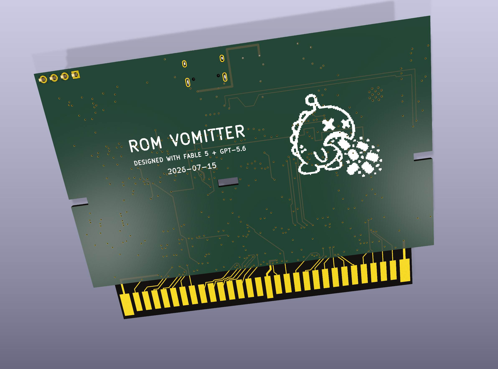
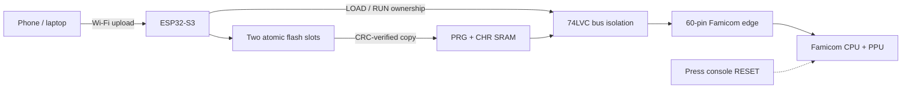

# FC ROM Vomitter

[日本語](README_JA.md) · [Schematic PDF](docs/nescart-fc-schematic.pdf) · [Manufacturing release](manufacturing/rev-a-fc/)

[](https://github.com/Keitark/fc-rom-vomitter/actions/workflows/validate.yml)
[](https://www.kicad.org/)
[](https://docs.espressif.com/projects/esp-idf/)
[](#project-status)
[](LICENSE)
[](LICENSES/CC-BY-SA-4.0.txt)

**Upload an NROM homebrew ROM from a phone, load it into SRAM, and run it on a Japanese Famicom.** No EPROM programmer, cartridge swapping, or battery-backed memory.

The native 60-pin Famicom Rev A-FC is the primary design. A frozen 72-pin NES-001 predecessor is preserved under [`experimental/nes/`](experimental/nes/) for comparison and further development; it is not part of the FC manufacturing release.



> [!WARNING]
> Rev A-FC has a fabrication-complete design and build-tested firmware, but the assembled hardware has not completed bench validation. Do not insert an untested board into a Famicom. The 10 mm taller PCB also needs a custom shell; original cartridge-shell compatibility is not claimed.

## What it does

1. The ESP32-S3 creates a Wi-Fi access point and browser upload page.
2. An uploaded mapper-0 `.nes` image is CRC-checked and committed to one of two flash slots.
3. At power-up, the ESP32 isolates the console bus, copies PRG and CHR data into SRAM, and verifies every byte.
4. The bus changes to RUN ownership and the blue LED becomes solid.
5. Press the **Famicom console's red RESET button** to start the game.

Unlike the front-loader NES, the Famicom has no CIC lockout circuit. The cartridge therefore cannot automatically hold and release console reset; the explicit RESET press is part of the Rev A-FC user flow.



## Hardware at a glance

| Area | Rev A-FC |
|---|---|
| Console | Japanese Famicom 60-pin cartridge slot |
| Supported image | iNES mapper 0 / NROM, 16 or 32 KiB PRG, 8 KiB CHR |
| Loader | ESP32-S3-WROOM-1-N8, SoftAP + browser upload |
| Game storage | Two atomic slots in ESP32 flash |
| Console memory | Two CY62128 128K × 8 SRAMs |
| Bus safety | 74LVC245 isolation with fail-safe LOAD/RUN defaults |
| PCB | 6 layers, 90.0 × 66.8 mm envelope, 1.2 mm, 60 gold fingers |
| Audio | Famicom sound loop through fitted 0 Ω R20 |
| Power/debug | Console 5 V plus USB-C bench power and native USB flashing |

The board keeps the standard-width tongue, connector datum, notches, centre slot, and 1.2 mm mating thickness. Only the edge opposite the fingers is extended by 10 mm for routing space.

## Project status

| Gate | Status | Evidence |
|---|---|---|
| Schematic ERC | **PASS** — 0 errors, 8 reviewed warnings | [`erc.json`](manufacturing/rev-a-fc/evidence/erc.json) |
| PCB connectivity | **PASS** — 0 raw opens | [`drc-classified.json`](manufacturing/rev-a-fc/evidence/drc-classified.json) |
| Classified DRC | **PASS** — 0 real errors | [`drc-classified.json`](manufacturing/rev-a-fc/evidence/drc-classified.json) |
| Layout policy | **PASS** — 0 failures | [`layout-check.txt`](manufacturing/rev-a-fc/evidence/layout-check.txt) |
| CPL registration | **PASS** — 79 fitted references, 0 unresolved | [`cpl-audit.txt`](manufacturing/rev-a-fc/evidence/cpl-audit.txt) |
| Firmware host tests/build | **PASS in preparation; continuously checked by CI** | [workflow](.github/workflows/validate.yml) |
| Electrical/mechanical bench validation | **PENDING** | [bring-up checklist](docs/bring-up.md) |

“0 opens” is not treated as completion by itself. The release also requires classified DRC, power continuity, reference-plane checks, silkscreen review, CPL registration, and visual inspection.

## Quick start for developers

### Firmware

Install [PlatformIO](https://platformio.org/), then:

```powershell
cd firmware
pio run -e esp32-s3
```

Host-test the iNES parser, CRC, and atomic-slot selection:

```powershell
cmake -S host_tests -B host_tests/build
cmake --build host_tests/build --config Release
ctest --test-dir host_tests/build -C Release --output-on-failure
```

The default development access-point password is `vomit-roms`. Change it through menuconfig before using the cartridge in a shared or public environment.

### Hardware

Open [`hardware/nescart-fc.kicad_pro`](hardware/nescart-fc.kicad_pro) in KiCad 10. The checked-in PCB is the exact revision used to create the public manufacturing package.

The schematic is generator-backed:

```powershell
python hardware/tools/gen_sch.py
```

Edit the netlist tables in `gen_sch.py`; do not hand-edit generated connectivity in the `.kicad_sch` files. See [hardware/README.md](hardware/README.md) before regenerating anything.

## Manufacturing release

[`manufacturing/rev-a-fc/`](manufacturing/rev-a-fc/) contains:

- revision-locked Gerber + drill ZIP;
- engineering and JLCPCB-format BOM/CPL files;
- CPL registration audit and assembly drawing;
- DRC/ERC/layout/silkscreen evidence;
- top and bottom manufacturing views and paste-stencil preview;
- a SHA-256 manifest checked in CI.

These files are published for review and reproducibility, **not as a recommendation to order an unvalidated board unchanged**. Read [manufacturing notes](docs/manufacturing.md) and the [bench bring-up gate](docs/bring-up.md) first.

## Experimental NES variant

[`experimental/nes/`](experimental/nes/) preserves the earlier 72-pin front-loader NES-001 design. It uses an ATtiny CIC clone to hold the console in reset while the ESP32 loads SRAM, which is materially different from the manual-reset FC flow. The snapshot passed its recorded schematic and PCB checks, but its assembly-placement gate and hardware validation are incomplete, so it is intentionally **not fabrication-ready**.

## Repository map

```text
hardware/                 KiCad 10 release source, libraries, models and core generators
firmware/                 ESP-IDF / PlatformIO loader firmware and host tests
manufacturing/rev-a-fc/   sanitized Gerber, BOM, CPL, evidence and hashes
experimental/nes/          frozen 72-pin NES-001 design snapshot (not released)
docs/                     architecture, bring-up, manufacturing and licensing notes
scripts/                  repository and release-integrity checks
```

## Documentation

- [Architecture and safety invariants](docs/architecture.md)
- [First-board bring-up](docs/bring-up.md)
- [Manufacturing and release interpretation](docs/manufacturing.md)
- [FC60 pin map](hardware/docs/pinout-fc.md)
- [Layout and electrical guidance](hardware/docs/layout-electrical-guidance.md)
- [Licensing and attribution](docs/licensing.md)
- [Japanese README / 日本語](README_JA.md)

## License and credits

This is a dual-licensed repository. Software and original general documentation are MIT. KiCad hardware design files, manufacturing artifacts, and designated visual/model assets are CC BY-SA 4.0; see [the exact scope and attributions](docs/licensing.md).

Connector behavior and dimensional research reference the community-maintained [NESdev Wiki](https://www.nesdev.org/wiki/Cartridge_connector) and the [NES/Famicom cartridge dimensions project](https://github.com/Gumball2415/NES-Famicom-Cartridge-Dimensions). The SRAM STEP model is from KiCad Packages3D and retains its upstream license and exception.

Famicom and Nintendo are trademarks of Nintendo. This independent project is not affiliated with or endorsed by Nintendo. Use homebrew software you have the right to run.
