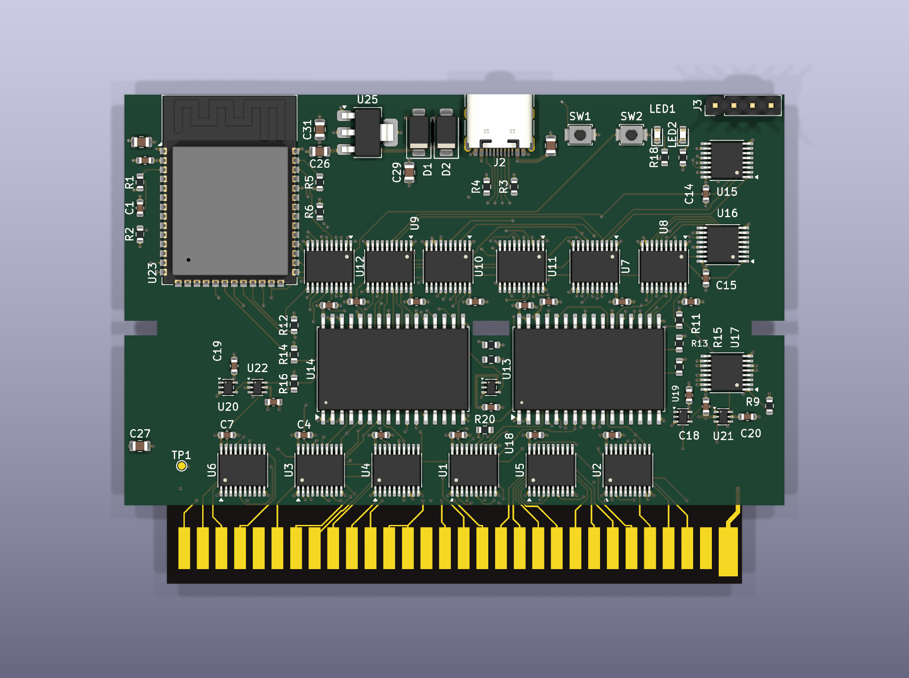
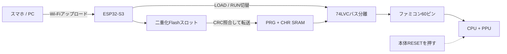

# FC ROM Vomitter

[English](README.md) · [回路図PDF](docs/nescart-fc-schematic.pdf) · [製造リリース](manufacturing/rev-a-fc/)

[](https://github.com/Keitark/fc-rom-vomitter/actions/workflows/validate.yml)
[](https://www.kicad.org/)
[](docs/bring-up.md)
[](LICENSE)
[](LICENSES/CC-BY-SA-4.0.txt)

**スマホからNROM形式の自作ROMをWi-Fiで送り、実機ファミコンで動かすための開発カートリッジです。** EPROMの書き換えやカートリッジの差し替えは不要です。

主対象は60ピンのファミコン版 Rev A-FCです。先行して設計した72ピンNES-001版は、比較・今後の実験用として[`experimental/nes/`](experimental/nes/)に凍結保存しています。FC版の製造リリースには含みません。

## 実際の基板ビュー

| 部品実装面 | アート面 |
|---|---|
|  |  |

> [!WARNING]
> Rev A-FCは回路・基板・製造データまで完成していますが、組み立て済み基板での実機検証はまだです。未検証基板をいきなりファミコンへ挿さないでください。また基板上端を10 mm延長しているため、純正カートリッジケースには対応せず、専用ケースが必要です。

## どう動くか

1. ESP32-S3がWi-Fiアクセスポイントとアップロード画面を提供します。
2. mapper 0の`.nes`ファイルを検査し、ESP32内蔵Flashの二重化スロットへ保存します。
3. 起動時にファミコン側バスを切り離し、PRG/CHRデータをSRAMへ転送して全バイトを照合します。
4. バス所有権をRUN側へ切り替え、青LEDが点灯します。
5. **ファミコン本体の赤いRESETボタン**を押すとゲームが開始します。

ファミコンにはNESのようなCICロックアウトがないため、カートリッジから本体を自動リセットできません。READY後に本体RESETを押すところまでがRev A-FCの通常手順です。



## 現在の状態

| ゲート | 状態 |
|---|---|
| 回路図ERC | **PASS** — エラー0、確認済み警告8 |
| 基板接続 | **PASS** — 未接続0 |
| 分類済みDRC | **PASS** — 実エラー0 |
| レイアウト規則 | **PASS** — FAIL 0 |
| CPL位置合わせ | **PASS** — 実装79部品、未解決0 |
| ファームウェア | ホストテスト・ESP32-S3ビルドをCIで確認 |
| 実機・電源・熱・機構検証 | **PENDING** |

「未接続0」だけでは完成扱いにしていません。電源接続、GND面、実DRC、シルク、CPL原点・回転、両面レンダーまで別々に確認したリリースです。

## まず見る場所

- [構成と安全設計](docs/architecture.md)
- [初号機の安全な立ち上げ手順](docs/bring-up.md)
- [製造データの説明](docs/manufacturing.md)
- [ファミコン60ピン表](hardware/docs/pinout-fc.md)
- [回路図PDF](docs/nescart-fc-schematic.pdf)
- [ライセンスと出典](docs/licensing.md)

## ビルド

```powershell
cd firmware
pio run -e esp32-s3

cmake -S host_tests -B host_tests/build
cmake --build host_tests/build --config Release
ctest --test-dir host_tests/build -C Release --output-on-failure
```

KiCad 10では[`hardware/nescart-fc.kicad_pro`](hardware/nescart-fc.kicad_pro)を開きます。収録PCBは公開製造パッケージを作った版と同一です。

## 製造データについて

[`manufacturing/rev-a-fc/`](manufacturing/rev-a-fc/)にはGerber/Drill ZIP、BOM、JLCPCB向けCPL、位置合わせ監査、ERC/DRC証拠、製造ビュー、ステンシル用F.Pasteプレビュー、SHA-256マニフェストを収録しています。

ただし、これは再現性とレビューのための公開です。**実機検証前の基板をそのまま注文することを推奨するものではありません。** 必ず[立ち上げ手順](docs/bring-up.md)を読んでください。

## 実験的なNES版

[`experimental/nes/`](experimental/nes/)には、フロントローダーNES-001用72ピン版を保存しています。ATtinyのCICクローンで本体をリセット状態に保ちながらSRAMをロードする構成で、ファミコン版の手動RESET方式とは異なります。記録上の回路図・PCB検査は通過していますが、実装位置の最終承認と実機検証が未完了のため、**製造可能なリリースとしては扱いません**。

## ライセンス

ソフトウェアと一般ドキュメントはMIT、KiCadハードウェア、製造データ、指定した画像・モデルはCC BY-SA 4.0です。詳しい範囲と出典は[ライセンス文書](docs/licensing.md)にあります。

本プロジェクトは任天堂とは無関係の個人開発です。権利を保有する自作・Homebrewソフトウェアで使用してください。
