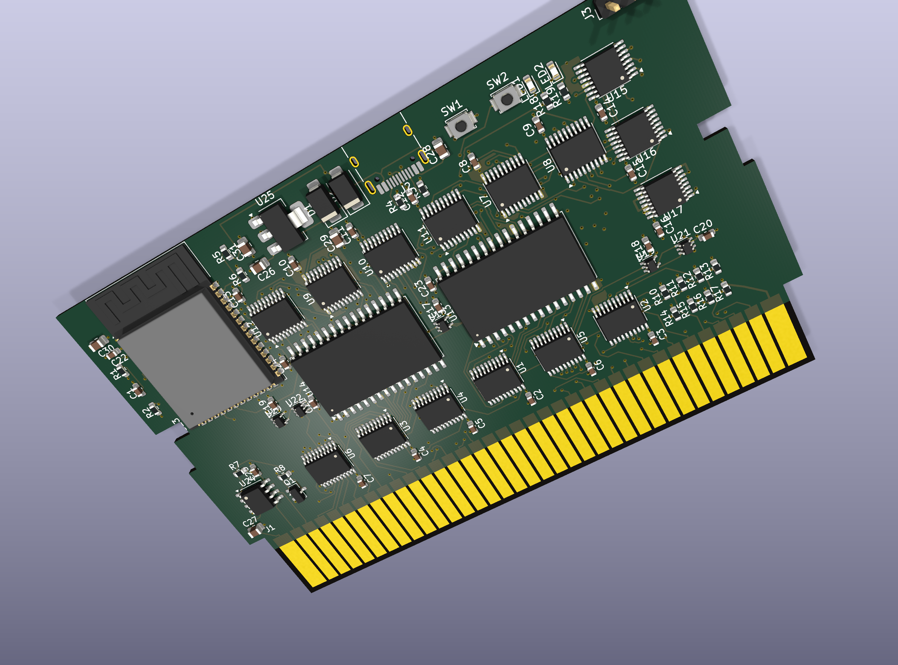
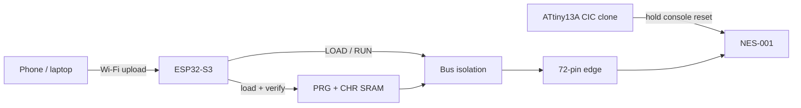

# Experimental 72-pin NES-001 variant

[日本語](#日本語) · [Schematic PDF](docs/nescart-schematic.pdf)

This directory preserves the earlier front-loader NES-001 design as an experimental snapshot. It is included to make the architectural differences and design history reviewable; it is **not part of the Rev A-FC manufacturing release**.

## Why it differs from the Famicom board

The NES-001 contains a CIC lockout circuit. An ATtiny13A running a CIC-clone firmware keeps the console in reset while the ESP32-S3 owns the cartridge SRAM bus, then permits boot only after the ROM image has been copied and verified.

## Frozen snapshot status

| Item | Recorded state |
|---|---|
| Target | Front-loader NES-001, 72-pin, NROM |
| PCB | 6 layers, 1.2 mm, CY62128 SRAM variant |
| ERC | 0 errors, 8 reviewed warnings |
| Raw disconnects | 0 |
| Classified DRC | 0 real errors |
| Layout policy | 0 failures |
| Assembly placement | **Incomplete** — browser-only placement edits existed and a clean regenerated CPL review was still required |
| Bench validation | **Not completed** |

The snapshot also records accepted prototype USB risks: 2.63 mm D+/D− length skew, one-via asymmetry, and no connector-side ESD device. Re-audit those choices before deriving hardware from this version.

The exact source hashes are recorded in [`evidence/snapshot.json`](evidence/snapshot.json). No Gerber/BOM/CPL manufacturing bundle is published for this experimental variant.

## License and attribution

The KiCad source, renders, and evidence in this directory are CC BY-SA 4.0. The cartridge edge footprint and board geometry derive from [emeargt/nes-cnrom](https://github.com/emeargt/nes-cnrom). See the repository [licensing details](../../docs/licensing.md).

## 日本語

ここにはフロントローダーNES-001用72ピン版の設計スナップショットを、実験資料として保存しています。ATtiny13AのCICクローンで本体をリセット状態に保ち、その間にESP32-S3がSRAMへROMを書き込む構成です。

回路図・未接続・分類済みDRC・レイアウト検査は記録上PASSですが、JLCPCB上の部品位置確認でブラウザ内だけの補正が残っており、元CPLへ反映して再生成・再アップロードする最終ゲートが未完了でした。実機検証も未完了です。このため、FC版とは分離し、**そのまま製造するためのリリースではありません**。
